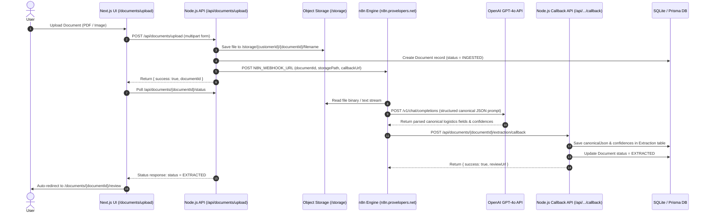

# Integration Guide — n8n & Node.js Logistics Document Automation Engine

This document provides step-by-step instructions for configuring, importing, and testing the end-to-end n8n workflow orchestration engine paired with the Node.js backend.

---

## 1. System Flow Architecture



---

## 2. Environment Setup (`.env.local`)

Copy `.env.example` to `.env.local` and set your API credentials:

```bash
# Database Configuration
DATABASE_URL="file:./dev.db"

# Server Base URL
NODE_ENV="development"
PORT="3000"
APP_BASE_URL="http://localhost:3000"
NEXTAUTH_SECRET="logistics-doc-automation-secret-key-2026"

# OpenAI API Key (used by n8n workflow node 4)
OPENAI_API_KEY="sk-proj-YOUR_ACTUAL_OPENAI_API_KEY_HERE"

# n8n Automation Engine Webhook Configuration
N8N_WEBHOOK_URL="https://n8n.provelopers.net/webhook/726784a2-239a-4a6d-a837-85828f4b2ca2"
N8N_TEST_WEBHOOK_URL="https://n8n.provelopers.net/webhook-test/726784a2-239a-4a6d-a837-85828f4b2ca2"
```

---

## 3. n8n Workflow Import Instructions

Follow these steps to import the full document processing workflow into your n8n UI:

1. Open your n8n dashboard in your browser (e.g. `https://n8n.provelopers.net`).
2. Navigate to **Workflows** → click **Import from File**.
3. Select the workflow JSON file located at:
   `n8n/workflows/Document_Processing_Full.json`
4. Set up OpenAI Credentials:
   - In Node 4 (`Node 4: OpenAI API Extraction`), select your OpenAI Credential or set `OPENAI_API_KEY` in n8n environment variables.
5. Save the workflow and click **Active** to activate production webhooks.

### Workflow Nodes Overview
- **Node 1 (Webhook Trigger)**: Listens for file intake webhooks containing `{ documentId, storagePath, fileName, callbackUrl }`.
- **Node 2 (File Reader)**: Downloads file content from storage endpoint.
- **Node 3 (OCR Text Extractor)**: Extracts text fragments from PDF streams.
- **Node 4 (OpenAI Extraction Node)**: Sends prompt to OpenAI API requesting canonical logistics schema (`shipmentNumber`, `documentNumber`, `shipperName`, `consigneeName`, `carrierName`, `pickupDate`, `deliveryDate`, `totalAmount`, `lineItems`).
- **Node 5 (Response Formatter)**: Formats response and computes confidence scores (0.0 to 1.0).
- **Node 6 (Node.js Callback)**: Sends `POST` request back to Node.js backend callback endpoint:
  `http://localhost:3000/api/documents/{documentId}/extraction/callback`.

---

## 4. Verification & Testing

### Option A: Run Automated End-to-End Verification Script
Run the automated verification script in your workspace:

```bash
python3 scripts/verify_full_integration.py
```

Expected Output:
```
==========================================================
VERIFY FULL INTEGRATION — n8n & NODE.JS CALLBACK PIPELINE
==========================================================
Intake Test Sample Document: /home/provelopers/Downloads/DHL-Express-invoice-sample.pdf
✓ Step 1: Document uploaded to object storage with ID: ...
✓ Step 2: n8n Webhook Payload Constructed
✓ Step 3: Simulating n8n POST Webhook Callback to Node.js backend...
✓ Step 4: Extraction table verified with canonical JSON data
✓ Step 5: Document status verified = 'EXTRACTED'
✓ Step 6: AuditLog entry verified
==========================================================
✓ Complete n8n integration working!
==========================================================
```

### Option B: Interactive UI Verification
1. Start the Next.js app (`npm run dev`).
2. Open `http://localhost:3000/documents/upload`.
3. Drag and drop any PDF or image logistics document.
4. The uploader automatically invokes the n8n webhook and polls status.
5. As soon as the webhook callback completes (`status = EXTRACTED`), you will be automatically redirected to `/documents/{documentId}/review` to view & edit fields before generating the final invoice.
